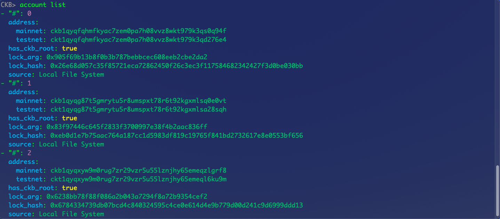
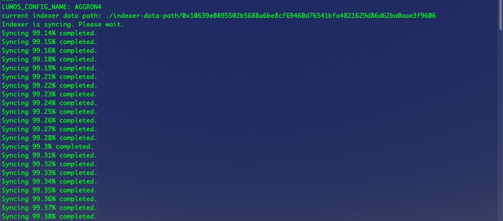
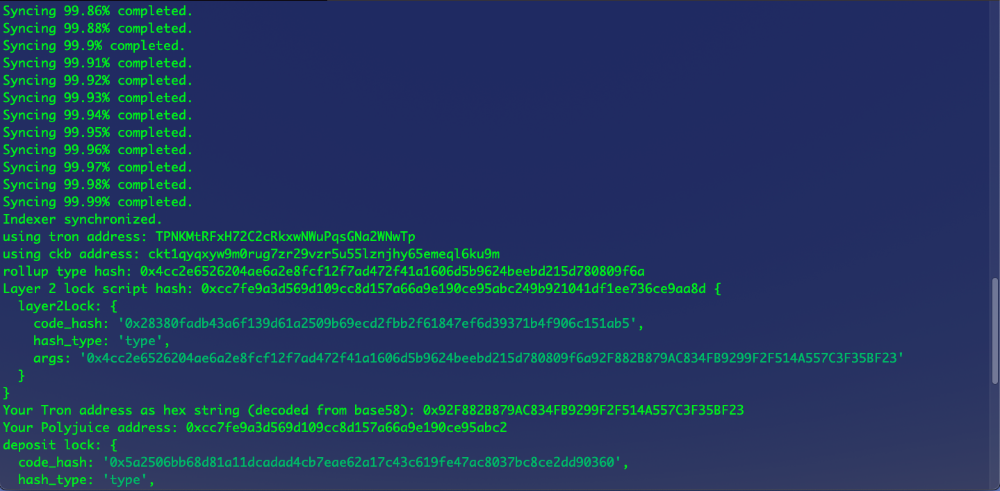
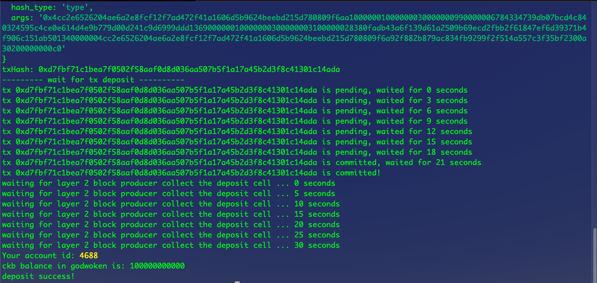
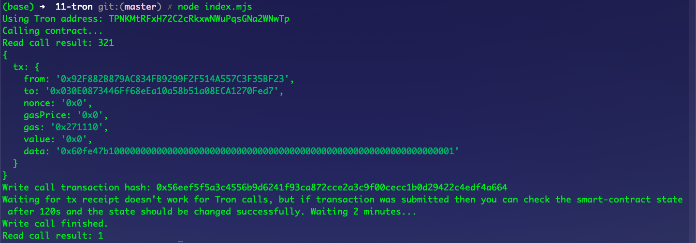

# Gitcoin: 11) Use A Tron Wallet To Execute A Smart Contract Call
## A screenshot of the accounts I created (account list) in ckb-cli:



## 2. A link to the Layer 1 address I funded on the Testnet Explorer:
https://explorer.nervos.org/aggron/address/ckt1qyqxyw9m0rug7zr29vzr5u55lznjhy65emeql6ku9m

## 3. A screenshot of the console output immediately after I have successfully submitted a CKByte deposit to your Tron account on Layer 2:





## 4. A screenshot of the console output immediately after I have successfully issued a smart contract calls on Layer 2:



## 5. The transaction hash of the "Contract call" from the console output (in text format):
```sh
0x56eef5f5a3c4556b9d6241f93ca872cce2a3c9f00cecc1b0d29422c4edf4a664
```

## 6. The contract address that I called (in text format):
```sh
0x030E0873446Ff68eEa10a58b51a08ECA1270Fed7
```

## 7. The ABI for contract I made a call on (in text format):
```json
[
    {
        "inputs": [],
        "stateMutability": "payable",
        "type": "constructor"
    },
    {
        "inputs": [],
        "name": "get",
        "outputs": [
            {
                "internalType": "uint256",
                "name": "",
                "type": "uint256"
            }
        ],
        "stateMutability": "view",
        "type": "function"
    },
    {
        "inputs": [
            {
                "internalType": "uint256",
                "name": "x",
                "type": "uint256"
            }
        ],
        "name": "set",
        "outputs": [],
        "stateMutability": "payable",
        "type": "function"
    }
];
```
## 8. My Tron address (in text format):
```sh
TPNKMtRFxH72C2cRkxwNWuPqsGNa2WNwTp
```